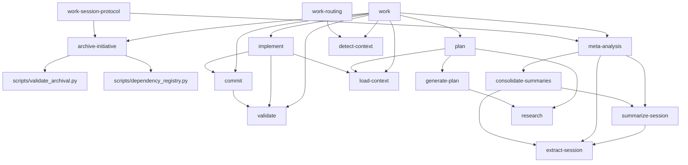

# Workflow Dependencies

**Generated:** Auto-generated from frontmatter

## Dependency Graph

## Dependency Details

| Workflow | Dependencies | Complexity |
|----------|--------------|------------|
| archive-initiative | scripts/validate_archival.py, scripts/dependency_registry.py | 50 |
| bump-version | None | 70 |
| commit | validate | 55 |
| consolidate-summaries | extract-session, summarize-session | 70 |
| detect-context | None | 80 |
| extract-session | None | 55 |
| generate-plan | research | 60 |
| implement | load-context, validate, commit | 75 |
| load-context | None | 65 |
| meta-analysis | extract-session, summarize-session, consolidate-summaries | 60 |
| new-adr | None | 45 |
| plan | research, generate-plan, load-context | 70 |
| research | None | 50 |
| summarize-session | extract-session | 55 |
| update-docs | None | 55 |
| validate | None | 62 |
| work | detect-context, load-context, implement, plan, validate, commit, archive-initiative, meta-analysis | 85 |
| work-routing | detect-context | 70 |
| work-session-protocol | archive-initiative, meta-analysis | 75 |
