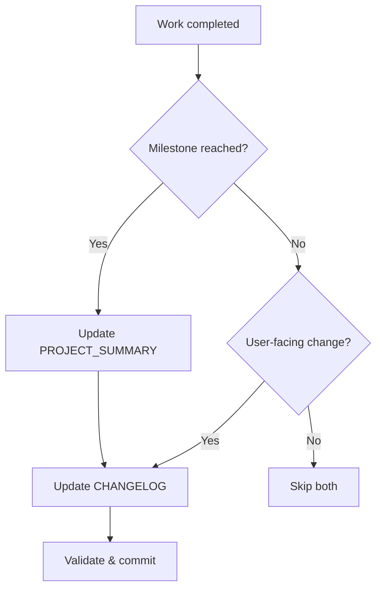

# Update Documentation Workflow

**Purpose:** Intelligently update living documentation (PROJECT_SUMMARY.md and CHANGELOG.md) when significant changes occur.

**Invocation:** `/update-docs` (called by `/work`, `/commit`, or directly)

**Philosophy:** Keep living docs synchronized with project state without manual overhead.

---

## Stage 0: Create Task Plan

🔄 **Entering /update-docs workflow**

**Create task plan:**

```typescript
update_plan({
  explanation: "📚 Starting /update-docs workflow",
  plan: [
    { step: "1. /update-docs - Assess update need", status: "in_progress" },
    { step: "2. /update-docs - Update PROJECT_SUMMARY.md", status: "pending" },
    { step: "3. /update-docs - Update CHANGELOG.md", status: "pending" },
    { step: "4. /update-docs - Validate changes", status: "pending" }
  ]
})
```

---

## When to Run

**Always check, but only update if:**

### PROJECT_SUMMARY.md Triggers

- Major features completed
- Project milestones reached
- New ADRs created
- Initiative status changed (Active → Completed)
- Architecture changes
- New dependencies added
- Major refactoring completed

### CHANGELOG.md Triggers

- Preparing for release
- Breaking changes introduced
- New user-facing features
- Security fixes
- Deprecations

**Skip if:**

- Routine bug fixes
- Internal refactoring (no API changes)
- Documentation-only changes
- Work-in-progress (not user-facing)

---

## Stage 1: Assess Update Need

### 1.1 Check Recent Activity

```bash
# What changed since last commit?
git diff HEAD~5..HEAD --name-only

# What type of commits?
git log --oneline -10 --pretty=format:"%s"
```

### 1.2 Evaluate Significance

**Decision Matrix:**

| Change Type | PROJECT_SUMMARY | CHANGELOG | Rationale |
|-------------|----------------|-----------|-----------|
| New feature (user-facing) | ✅ | ✅ | Both need update |
| Bug fix (minor) | ❌ | ❌ | Skip both |
| Breaking change | ✅ | ✅ | Critical update |
| New ADR | ✅ | ❌ | Architectural record |
| Dependency update | ✅ | Conditional | If major version |
| Refactor (internal) | ❌ | ❌ | No user impact |
| Security fix | ✅ | ✅ | High priority |
| Initiative completed | ✅ | ❌ | Project state |

---

## Stage 2: Update PROJECT_SUMMARY.md

### 2.1 Read Current Summary

```python
# Batch read for efficiency (MUST use absolute paths for MCP tools)
mcp0_read_multiple_files([
    "/home/gxx/projects/mcp-web/PROJECT_SUMMARY.md",
    "/home/gxx/projects/mcp-web/docs/initiatives/active/*.md"  # Check initiative status
])
```

### 2.2 Identify Sections to Update

**Common update sections:**

1. **Version** (if bumped)
2. **Status** (if milestone reached)
3. **Features** (if new capabilities)
4. **Architecture** (if ADR created)
5. **Dependencies** (if added/updated)

### 2.3 Apply Updates

**Use focused edits:**

```python
# Example: Update version
edit(
    file_path="/home/gxx/projects/mcp-web/PROJECT_SUMMARY.md",
    old_string="**Version:** 0.2.0",
    new_string="**Version:** 0.3.0",
    explanation="Bump version after feature release"
)

# Example: Add new feature
edit(
    file_path="/home/gxx/projects/mcp-web/PROJECT_SUMMARY.md",
    old_string="### Core Features\n\n- Feature A\n- Feature B",
    new_string="### Core Features\n\n- Feature A\n- Feature B\n- Feature C: New capability description",
    explanation="Add newly implemented feature"
)
```

### 2.4 Update Architecture References

**If ADR created:**

```python
# Update ADR list
edit(
    file_path="/home/gxx/projects/mcp-web/PROJECT_SUMMARY.md",
    old_string="- [ADR-0016](docs/adr/0016-title.md)",
    new_string="- [ADR-0016](docs/adr/0016-title.md)\n- [ADR-0017](docs/adr/0017-new-decision.md)",
    explanation="Add new ADR reference"
)
```

---

## Stage 3: Update CHANGELOG.md

### 3.1 Read Current Changelog

```python
mcp0_read_text_file("/home/gxx/projects/mcp-web/docs/reference/CHANGELOG.md")
```

### 3.2 Parse Recent Commits

**Extract commit messages since last release:**

```bash
# Get commits since last tag
git log $(git describe --tags --abbrev=0)..HEAD --pretty=format:"%h %s"

# Group by type (feat, fix, etc.)
git log --pretty=format:"%s" | grep -E "^(feat|fix|security|breaking):"
```

### 3.3 Group Changes by Type

**Follow Keep a Changelog format:**

```markdown
## [Unreleased]

### Added
- New feature X from commit abc123
- New feature Y from commit def456

### Changed
- Breaking change Z from commit ghi789

### Fixed
- Bug fix A from commit jkl012

### Security
- Security improvement B from commit mno345
```

### 3.4 Insert Unreleased Section

**Use edit tool:**

```python
edit(
    file_path="/home/gxx/projects/mcp-web/docs/reference/CHANGELOG.md",
    old_string="# Changelog\n\nAll notable changes to this project will be documented in this file.\n\n## [0.2.0]",
    new_string="# Changelog\n\nAll notable changes to this project will be documented in this file.\n\n## [Unreleased]\n\n### Added\n- Feature X\n\n### Fixed\n- Bug Y\n\n## [0.2.0]",
    explanation="Add unreleased changes for next version"
)
```

---

## Stage 4: Validation

### 4.1 Verify Markdown Syntax

```bash
# Run markdownlint to check syntax
npx markdownlint-cli2 PROJECT_SUMMARY.md docs/reference/CHANGELOG.md
```

**If errors:** Fix syntax issues before committing

### 4.2 Check Consistency

**Verify:**

- Version numbers match across files
- All ADRs referenced exist
- Links are valid
- No broken references

### 4.3 Review Changes

```bash
# Show what changed
git diff PROJECT_SUMMARY.md docs/reference/CHANGELOG.md
```

**Sanity check:**

- Changes align with actual work done
- No accidental deletions
- Formatting preserved

---

## Stage 5: Integration

### 5.1 Stage Documentation Updates

```bash
# Stage updated docs
git add PROJECT_SUMMARY.md docs/reference/CHANGELOG.md
```

### 5.2 Commit Separately (If Standalone)

**If called directly (not from `/commit`):**

```bash
git commit -m "docs: update PROJECT_SUMMARY and CHANGELOG

- Update version to 0.3.0
- Add feature X to summary
- Document breaking changes in changelog

Refs: docs/initiatives/active/feature-x.md"
```

### 5.3 Include in Main Commit (If Called from Workflow)

**If called from `/work` or `/commit`:**

- Include doc updates in the same commit as implementation
- Document updates should be atomic with code changes

---

## Decision Logic

### When Called from `/work`



### When Called Directly

```markdown
1. User invokes `/update-docs`
2. Assess both PROJECT_SUMMARY and CHANGELOG
3. Prompt user: "Found X changes. Update both/one/skip?"
4. Apply requested updates
5. Commit documentation changes
```

---

## Examples

### Example 1: Feature Completion

**Context:** Just completed API key authentication feature

**Updates:**

```markdown
PROJECT_SUMMARY.md:
- Add "API Key Authentication" to features list
- Update dependencies (added pydantic-settings)

CHANGELOG.md:
- Add to [Unreleased] > Added: "API key authentication with bcrypt hashing"
```

**Commit:**

```bash
docs: update PROJECT_SUMMARY with API auth feature

- Add API key authentication to features
- Document pydantic-settings dependency
```

### Example 2: Breaking Change

**Context:** Changed CLI command syntax

**Updates:**

```markdown
CHANGELOG.md:
- Add to [Unreleased] > Changed: "BREAKING: CLI now uses `test-robots` instead of `robots`"

PROJECT_SUMMARY.md:
- Update CLI examples with new syntax
```

**Commit:**

```bash
docs: document breaking CLI change in CHANGELOG

BREAKING CHANGE: CLI command renamed from `robots` to `test-robots`
```

### Example 3: Skip Update

**Context:** Fixed typo in internal function

**Decision:** Skip both (no user-facing impact)

---

## Anti-Patterns

### ❌ Don't: Update for Every Commit

**Bad:**

```markdown
Every bug fix → Update CHANGELOG
Every refactor → Update PROJECT_SUMMARY
Result: Docs become noise, lose signal
```

**Good:**

```markdown
User-facing changes → Update CHANGELOG
Milestones → Update PROJECT_SUMMARY
Result: Docs stay high-signal
```

### ❌ Don't: Update Manually Without Context

**Bad:**

```markdown
User: "Update the changelog"
AI: *adds generic entry without checking commits*
```

**Good:**

```markdown
AI: *analyzes git log*
AI: *identifies significant changes*
AI: *groups by type*
AI: *adds structured entries*
```

### ❌ Don't: Mix WIP and Released

**Bad:**

```markdown
CHANGELOG.md:
## [Unreleased]
- Half-done feature (WIP)
```

**Good:**

```markdown
CHANGELOG.md:
## [Unreleased]
- Completed, tested, merged features only
```

---

## Integration Points

### Called By

- `/work` - After major work completion
- `/commit` - Before final commit (if significant)
- `/meta-analysis` - At session end (if milestones reached)
- User - Direct invocation

### Calls

- None (leaf workflow)

---

## References

- [Keep a Changelog](https://keepachangelog.com/)
- [Semantic Versioning](https://semver.org/)
- Project: `PROJECT_SUMMARY.md`
- Project: `docs/reference/CHANGELOG.md`

---
