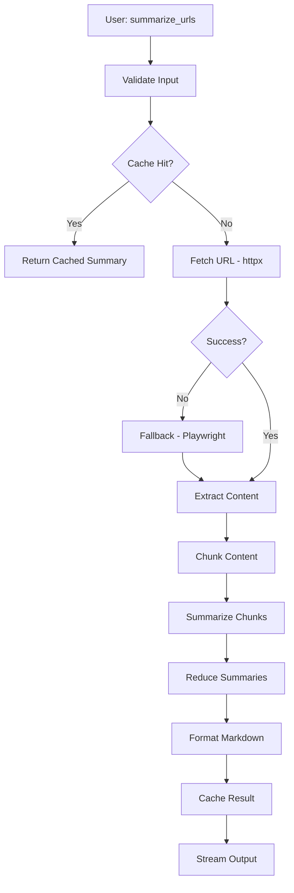

# MCP Web Summarization Tool - Architecture & Design

**Project:** `mcp-web` - MCP Server for Web Summarization 
**Created:** 2025-10-15 
**Status:** Initial Design & Planning

---

## Table of Contents

1. [Project Overview](#project-overview)
2. [Architecture Plan](#architecture-plan)
3. [Module Breakdown](#module-breakdown)
4. [Data Flow](#data-flow)
5. [Technology Stack](#technology-stack)
6. [Design Decisions Log](#design-decisions-log)
7. [Implementation Milestones](#implementation-milestones)
8. [Configuration Strategy](#configuration-strategy)
9. [Testing Strategy](#testing-strategy)
10. [Future Enhancements](#future-enhancements)

---

## Project Overview

### Mission

Build a monolithic MCP tool `summarize_urls` that:

- Fetches one or more URLs (HTML/PDF)
- Extracts main content intelligently
- Chunks content hierarchically and semantically
- Optionally follows strong reference links (recursive)
- Produces query-focused, abstractive Markdown summaries
- Streams output for responsiveness
- Caches intermediate results for efficiency

### Key Requirements

- **Input:** List of URLs + optional query string
- **Output:** Markdown summary with citations, code snippets, external references
- **Context Window:** Configurable up to 32k tokens
- **Caching:** Disk-based, ~1 week TTL
- **Performance:** Async fetching, parallel processing where possible
- **Robustness:** Fallback strategies (httpx → Playwright), error handling
- **Extensibility:** Modular design for future enhancements (embeddings, per-domain rules)

---

## Architecture Plan

### High-Level Pipeline

```
URLs → Fetch → Extract → Chunk → Summarize → Reduce → Markdown Output
 ↓ ↓ ↓ ↓
 [Cache] [Cache] [Cache] [Cache]
```

### Modules

```
mcp-web/
├── src/
│ └── mcp_web/
│ ├── __init__.py
│ ├── mcp_server.py # MCP tool entry point
│ ├── fetcher.py # URL fetching (httpx + Playwright fallback)
│ ├── extractor.py # Content extraction (trafilatura)
│ ├── chunker.py # Hierarchical + semantic chunking
│ ├── summarizer.py # LLM-based summarization (streaming)
│ ├── cache.py # Disk cache manager
│ ├── metrics.py # Logging, diagnostics, timing
│ ├── config.py # Configuration management
│ └── utils.py # Token counting, markdown formatting
├── tests/
│ ├── unit/ # Unit tests per module
│ └── integration/ # End-to-end tests
├── docs/
│ ├── ARCHITECTURE.md # This file
│ ├── API.md # Module API documentation
│ └── DECISIONS.md # Design decision log
├── examples/
│ └── sample_usage.py # Example MCP client calls
├── pyproject.toml # Dependencies & project metadata
├── README.md # User-facing documentation
└── .gitignore
```

---

## Module Breakdown

### 1. `mcp_server.py` - MCP Tool Entry Point

**Purpose:** Expose the `summarize_urls` tool via MCP protocol.

**Responsibilities:**

- Register MCP tool with schema (input: urls, query, config)
- Validate inputs
- Orchestrate pipeline: fetch → extract → chunk → summarize → reduce
- Handle streaming output
- Error handling and user-facing messages

**Key APIs:**

```python
async def summarize_urls(
 urls: List[str],
 query: Optional[str] = None,
 max_tokens: int = 32000,
 follow_links: bool = False,
 **config
) -> AsyncIterator[str]:
 """MCP tool: Generate query-focused summary from URLs."""
```

---

### 2. `fetcher.py` - URL Fetching

**Purpose:** Fetch HTML/PDF content with fallback strategies.

**Strategy:**

1. **Primary:** `httpx` async GET (fast, respects headers)
2. **Fallback:** Playwright headless browser (for JS-heavy sites)
3. **Caching:** Use ETags/Last-Modified headers

**Key APIs:**

```python
async def fetch_url(
 url: str,
 use_playwright: bool = False,
 timeout: int = 30
) -> FetchResult:
 """Fetch URL content with automatic fallback."""

@dataclass
class FetchResult:
 url: str
 content: bytes
 content_type: str
 headers: Dict[str, str]
 status_code: int
 fetch_method: str # 'httpx' or 'playwright'
```

**Design Decisions:**

- **DD-001:** Use httpx for speed; Playwright only on 403/timeout/empty content
- **DD-002:** Respect `robots.txt` (optional flag)
- **DD-003:** User-Agent rotation to avoid blocking

---

### 3. `extractor.py` - Content Extraction

**Purpose:** Extract main content, metadata, and structure from HTML/PDF.

**Technology:**

- **HTML:** `trafilatura` (best accuracy for main content)
- **PDF:** `pypdf` or `pdfplumber` (fallback to OCR if needed)

**Key APIs:**

```python
async def extract_content(
 fetch_result: FetchResult
) -> ExtractedContent:
 """Extract main content and metadata."""

@dataclass
class ExtractedContent:
 url: str
 title: str
 content: str # Plain text or Markdown
 metadata: Dict[str, Any]
 links: List[str] # Outbound links for recursive fetching
 code_snippets: List[CodeSnippet]
 timestamp: datetime
```

**Design Decisions:**

- **DD-004:** Trafilatura's `favor_recall=True` to maximize content extraction
- **DD-005:** Preserve code blocks and tables in Markdown format
- **DD-006:** Extract reference links with heuristic scoring (prefer documentation, avoid social media)

---

### 4. `chunker.py` - Intelligent Chunking

**Purpose:** Split content into semantically coherent chunks.

**Strategy:**

- **Hierarchical:** Respect document structure (headings, sections)
- **Semantic:** Use sentence boundaries, paragraph breaks
- **Configurable:** Max tokens per chunk, overlap percentage

**Key APIs:**

```python
def chunk_content(
 content: str,
 max_tokens: int = 512,
 overlap: int = 50,
 strategy: str = "hierarchical"
) -> List[Chunk]:
 """Split content into chunks with overlap."""

@dataclass
class Chunk:
 text: str
 tokens: int
 metadata: Dict[str, Any] # section, heading, position
```

**Design Decisions:**

- **DD-007:** Default chunk size 512 tokens (balance context vs. granularity)
- **DD-008:** 50-token overlap to prevent context loss
- **DD-009:** Prioritize keeping code blocks intact
- **DD-010:** Use `tiktoken` for accurate token counting (cl100k_base encoding)

---

### 5. `summarizer.py` - LLM Summarization

**Purpose:** Generate query-focused, abstractive summaries.

**Strategy:**

- **Map-Reduce:** Summarize chunks individually → reduce into final summary
- **Query-Aware:** Include user query in prompt for focus
- **Streaming:** Stream partial results for responsiveness

**Key APIs:**

```python
async def summarize_chunks(
 chunks: List[Chunk],
 query: Optional[str] = None,
 model: str = "gpt-4"
) -> AsyncIterator[str]:
 """Generate streaming summary from chunks."""

async def reduce_summaries(
 summaries: List[str],
 query: Optional[str] = None
) -> str:
 """Combine intermediate summaries into final output."""
```

**Design Decisions:**

- **DD-011:** Use OpenAI GPT-4 by default (configurable)
- **DD-012:** Prompt engineering: "Summarize focusing on [query]. Include code examples and key references."
- **DD-013:** Two-stage summarization if total tokens > 8k (map → reduce)
- **DD-014:** Streaming via SSE or chunked responses

---

### 6. `cache.py` - Disk Cache Manager

**Purpose:** Persistent caching to avoid redundant fetches/processing.

**Strategy:**

- **Storage:** JSON files in `~/.cache/mcp-web/`
- **Keys:** SHA256(url + fetch_params)
- **TTL:** 7 days default (configurable)
- **Pruning:** LRU eviction when cache exceeds size limit

**Key APIs:**

```python
class CacheManager:
 async def get(self, key: str) -> Optional[Any]:
 """Retrieve cached value if valid."""
 
 async def set(self, key: str, value: Any, ttl: int = 7*24*3600):
 """Store value with TTL."""
 
 async def prune(self):
 """Remove expired entries."""
```

**Design Decisions:**

- **DD-015:** Cache layers: fetch results, extracted content, chunk summaries
- **DD-016:** Use ETags for HTTP cache validation
- **DD-017:** Max cache size: 1GB (configurable)

---

### 7. `metrics.py` - Logging & Diagnostics

**Purpose:** Track performance, errors, and usage metrics.

**Metrics:**

- Fetch times (httpx vs. Playwright)
- Extraction success rates
- Token usage per summary
- Cache hit/miss ratios
- Error types and frequencies

**Key APIs:**

```python
class MetricsCollector:
 def record_fetch(self, url: str, duration: float, method: str):
 """Log fetch metrics."""
 
 def record_error(self, module: str, error: Exception):
 """Log error for diagnostics."""
 
 def export_metrics(self) -> Dict[str, Any]:
 """Export metrics for analysis."""
```

**Design Decisions:**

- **DD-018:** Structured logging (JSON format)
- **DD-019:** Optional telemetry export (stdout or file)

---

### 8. `config.py` - Configuration Management

**Purpose:** Centralized configuration with validation.

**Configuration Sources:**

1. Environment variables (`MCP_WEB_*`)
2. Config file (`~/.config/mcp-web/config.yaml`)
3. Tool parameters (highest priority)

**Key Settings:**

```python
@dataclass
class Config:
 # Fetching
 fetch_timeout: int = 30
 use_playwright_fallback: bool = True
 max_concurrent_fetches: int = 5
 
 # Extraction
 favor_recall: bool = True
 extract_links: bool = True
 
 # Chunking
 chunk_size: int = 512
 chunk_overlap: int = 50
 
 # Summarization
 llm_model: str = "gpt-4"
 llm_api_key: Optional[str] = None
 max_context_tokens: int = 32000
 
 # Caching
 cache_enabled: bool = True
 cache_ttl: int = 7 * 24 * 3600
 cache_dir: str = "~/.cache/mcp-web"
 cache_max_size: int = 1024 * 1024 * 1024 # 1GB
```

---

### 9. `utils.py` - Utilities

**Purpose:** Shared helpers for token counting, markdown formatting, etc.

**Key Functions:**

```python
def count_tokens(text: str, encoding: str = "cl100k_base") -> int:
 """Count tokens using tiktoken."""

def format_markdown_summary(
 summary: str,
 sources: List[str],
 metadata: Dict[str, Any]
) -> str:
 """Format summary with citations and metadata."""

def validate_url(url: str) -> bool:
 """Validate URL format."""
```

---

## Data Flow

### Happy Path: Single URL Summary



### Multi-URL + Recursive Links

```
For each URL:
 1. Fetch & Extract (parallel)
 2. Score outbound links (if follow_links=True)
 3. Recursively fetch top N links (max depth=2)
 4. Aggregate all content
 5. Chunk + Summarize as single document
```

---

## Technology Stack

### Core Dependencies

- **MCP SDK:** `mcp` (Model Context Protocol)
- **HTTP Client:** `httpx` (async)
- **Browser Automation:** `playwright` (fallback)
- **Content Extraction:** `trafilatura` (HTML), `pypdf`/`pdfplumber` (PDF)
- **LLM Integration:** `openai` or `anthropic` SDK
- **Token Counting:** `tiktoken`
- **Caching:** Standard library `shelve` or `diskcache`
- **Testing:** `pytest`, `pytest-asyncio`, `pytest-mock`

### Development Tools

- **Linting:** `ruff`
- **Type Checking:** `mypy`
- **Formatting:** `black` or `ruff format`
- **Dependency Management:** `uv` or `pip-tools`

---

## Design Decisions Log

| ID | Decision | Rationale | Date |
|----|----------|-----------|------|
| DD-001 | httpx primary, Playwright fallback | Speed vs. robustness tradeoff | 2025-10-15 |
| DD-002 | Respect robots.txt (optional) | Ethical scraping | 2025-10-15 |
| DD-003 | Trafilatura for extraction | Best accuracy in benchmarks | 2025-10-15 |
| DD-004 | Hierarchical + semantic chunking | Preserve document structure | 2025-10-15 |
| DD-005 | 512-token chunks, 50-token overlap | Balance context and granularity | 2025-10-15 |
| DD-006 | Map-reduce summarization | Handles large documents | 2025-10-15 |
| DD-007 | Disk cache with 7-day TTL | Balance freshness and efficiency | 2025-10-15 |
| DD-008 | OpenAI GPT-4 default | High-quality summaries | 2025-10-15 |
| DD-009 | Streaming output | Better UX for long summaries | 2025-10-15 |
| DD-010 | tiktoken for token counting | Accurate for OpenAI models | 2025-10-15 |

---

## Implementation Milestones

### Phase 1: Scaffolding (Day 1)

- [x] Create project structure
- [ ] Set up dependencies (`pyproject.toml`)
- [ ] Implement `config.py` with validation
- [ ] Implement `utils.py` (token counting, validation)
- [ ] Set up testing framework

### Phase 2: Core Modules (Days 2-3)

- [ ] Implement `fetcher.py` + unit tests
- [ ] Implement `extractor.py` + unit tests
- [ ] Implement `chunker.py` + unit tests
- [ ] Implement `cache.py` + unit tests
- [ ] Implement `metrics.py` + unit tests

### Phase 3: Summarization (Day 4)

- [ ] Implement `summarizer.py` with map-reduce
- [ ] Add streaming support
- [ ] Unit tests with mock LLM

### Phase 4: Integration (Day 5)

- [ ] Implement `mcp_server.py` orchestration
- [ ] End-to-end integration tests
- [ ] Error handling and edge cases

### Phase 5: Polish (Day 6)

- [ ] Documentation (API docs, usage examples)
- [ ] Performance optimization
- [ ] Cache pruning logic
- [ ] Sample client scripts

---

## Configuration Strategy

### Environment Variables

```bash
export MCP_WEB_LLM_API_KEY="sk-..."
export MCP_WEB_CACHE_DIR="~/.cache/mcp-web"
export MCP_WEB_LOG_LEVEL="INFO"
```

### Config File (`~/.config/mcp-web/config.yaml`)

```yaml
fetcher:
 timeout: 30
 max_concurrent: 5
 playwright_fallback: true

chunker:
 size: 512
 overlap: 50
 strategy: hierarchical

summarizer:
 model: gpt-4
 max_tokens: 32000
 temperature: 0.3

cache:
 enabled: true
 ttl: 604800 # 7 days
 max_size: 1073741824 # 1GB
```

---

## Testing Strategy

### Unit Tests

- **Coverage Target:** 90%+
- **Mocking:** Mock httpx, Playwright, LLM API calls
- **Focus Areas:**
 - Edge cases (malformed HTML, empty content, network errors)
 - Cache hit/miss logic
 - Chunking boundary conditions
 - Token counting accuracy

### Integration Tests

- **Fixtures:** Sample HTML files, mock APIs
- **Scenarios:**
 - Single URL summary
 - Multi-URL aggregation
 - Recursive link following (max depth)
 - Cache persistence across runs
 - Error recovery (retry logic)

### Manual Testing

- **Real-world URLs:**
 - Documentation sites (Python docs, MDN)
 - Blog posts (Medium, dev.to)
 - Academic papers (arXiv)
 - GitHub README files

---

## Future Enhancements

### V2 Features (Post-MVP)

1. **Vector Embeddings:** Semantic search for relevant chunks
2. **Per-Domain Rules:** Custom extractors for Wikipedia, GitHub, etc.
3. **Multi-Modal:** Image/diagram extraction and description
4. **Collaborative Filtering:** User feedback to improve summaries
5. **Incremental Updates:** Re-summarize only changed content
6. **Multi-Language Support:** Translation integration
7. **PDF OCR:** For scanned documents
8. **Diff Summaries:** "What changed since last fetch?"

### Performance Optimizations

- Parallel chunk summarization
- Batched LLM requests
- Smart link prioritization (PageRank, relevance scoring)
- Compressed cache storage

### Observability

- Prometheus metrics export
- Distributed tracing (OpenTelemetry)
- Dashboard for cache analytics

---

## References & Research

### External Resources Consulted

1. **Trafilatura Documentation**
 - URL: https://trafilatura.readthedocs.io/en/latest/usage-python.html
 - Validated: `favor_recall` parameter, `include_*` options
 - Key Finding: `favor_recall=True` maximizes content extraction at minor precision cost
 - Applied: DD-002 decision

2. **Pinecone Chunking Strategies**
 - URL: https://www.pinecone.io/learn/chunking-strategies/
 - Validated: Hierarchical and semantic chunking approaches
 - Key Finding: 512-token chunks are optimal for most use cases
 - Applied: DD-003, DD-004 decisions

3. **MCP Python SDK**
 - URL: https://github.com/modelcontextprotocol/python-sdk
 - Validated: Tool registration with `@mcp.tool()` decorator
 - Key Finding: Streaming support via async iterators
 - Applied: mcp_server.py implementation

4. **LangChain Map-Reduce Summarization**
 - URL: https://python.langchain.com/docs/how_to/summarize_map_reduce/
 - Validated: Map-reduce pattern for long documents
 - Key Finding: Parallel chunk summarization → sequential reduction
 - Applied: DD-006 decision, summarizer.py implementation

### Key Insights

- **Content Extraction:** Trafilatura with `favor_recall=True` provides best balance for diverse sites
- **Chunking Strategy:** Hierarchical chunking preserves document structure better than fixed-size
- **Token Limits:** 512 tokens per chunk allows 16 chunks in 8k context window
- **Map-Reduce:** Threshold of 8k tokens triggers map-reduce for efficiency
- **Streaming:** AsyncIterator pattern enables responsive UX for long-running operations

---

## Maintenance Notes

### Code Style

- **Type Hints:** All public functions must have type annotations
- **Docstrings:** Google-style docstrings for all modules/classes/functions
- **Error Handling:** Explicit exception types, never bare `except`
- **Async:** Use `asyncio` consistently, avoid blocking calls

### Version Control

- **Branching:** `main` (stable), `develop` (integration), feature branches
- **Commits:** Conventional Commits format (`feat:`, `fix:`, `docs:`)
- **CI/CD:** GitHub Actions for tests, linting, type checking

### Deprecation Policy

- Mark deprecated features with warnings (1 version notice)
- Remove in next major version
- Document migration paths

---

**Last Updated:** 2025-10-15 
**Next Review:** After Phase 2 completion
