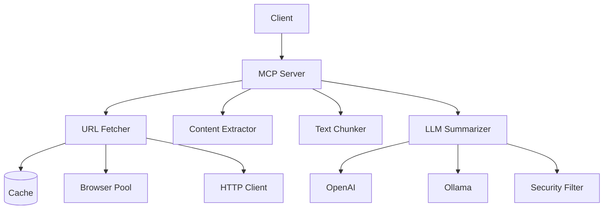

# MCP-Web Modernization Roadmap

**Created:** 2025-11-15
**Status:** Active
**Purpose:** Comprehensive improvement plan based on three expert panel audits

---

## Executive Summary

Three specialized review panels conducted comprehensive audits of the mcp-web codebase:

| Panel | Score | Status |
|-------|-------|--------|
| **Architecture & Code Quality** | 7.8/10 | Good - needs production hardening |
| **Documentation Quality** | 8.5/10 | Excellent - minor gaps |
| **Testing Standards** | 7.2/10 | Solid - coverage gaps exist |

**Overall Assessment:** Strong foundation with production-critical issues that must be addressed before deployment.

---

## Critical Findings Summary

### P0 - Deployment Blockers (Must Fix Before Production)

1. **Resource Leaks** - Browser/HTTP client leaks cause service failure after 6-24 hours
2. **Prompt Injection Vulnerability** - Web content not sanitized before LLM submission
3. **Version Mismatch** - `__init__.py` shows 0.1.0, `pyproject.toml` shows 0.2.0
4. **Token Counting Errors** - Using GPT-4 tokenizer for all providers causes 12.5% data loss
5. **Auth Module - 0% Test Coverage** - CRITICAL SECURITY GAP
6. **Placeholder Tests** - 9 empty test bodies create false coverage sense

### P1 - Production Risks (Fix Before v1.0)

1. **Global Singleton Pattern** - HTTP client and metrics use global state
2. **Missing Rate Limiting** - No DoS protection despite implementation existing
3. **Fetcher Under-Tested** - Only 15% coverage on core functionality
4. **Hardcoded Magic Numbers** - Configuration values embedded in code

### Strengths to Preserve

- ⭐ Exceptional OWASP LLM Top 10 security implementation
- ⭐ ADR-driven development (18 documented decisions)
- ⭐ Comprehensive documentation structure
- ⭐ Modern Python patterns with strong type safety
- ⭐ Browser pool pattern (newly implemented)
- ⭐ Structured logging and metrics

---

## Improvement Roadmap by Priority

## Phase 1: Critical Fixes (Week 1-2, ~40 hours)

### 1.1 Version Synchronization (2 hours)
**Status:** P0 - Immediate
**Files:** `src/mcp_web/__init__.py`

**Problem:**
```python
# __init__.py
__version__ = "0.1.0"  # Wrong!

# pyproject.toml
version = "0.2.0"  # Correct
```

**Solution:**
```python
# Use single source of truth
from importlib.metadata import version
__version__ = version("mcp-web")
```

---

### 1.2 Fix/Remove Placeholder Tests (4 hours)
**Status:** P0 - Immediate
**Files:** `tests/integration/test_playwright_fallback.py`

**Problem:** 9 tests with `pass` bodies:
```python
async def test_detect_js_rendered_content(self):
    pass  # TODO: Need mock for JS-rendered content
```

**Solution:** Either implement or create GitHub issues and remove

---

### 1.3 Create auth.py Tests (8 hours)
**Status:** P0 - CRITICAL SECURITY GAP
**Files:** Create `tests/unit/test_auth.py`

**Problem:** 0% coverage on authentication module
**Target:** 80%+ coverage
**Tests Needed:**
- Token validation
- Authentication flow
- Error handling
- Session management

---

### 1.4 Apply Prompt Injection Filtering to Web Content (8 hours)
**Status:** P0 - SECURITY VULNERABILITY
**Files:** `src/mcp_web/summarizer.py`

**Problem:**
```python
# Only query is sanitized, not web content!
if query and self.injection_filter.detect_injection(query):
    query = self.injection_filter.sanitize(query)
# BUT content is NOT sanitized!
```

**Solution:**
```python
def _build_summary_prompt(self, content: str, query: str | None, ...):
    # Sanitize BOTH
    if query:
        query = self.injection_filter.sanitize(query)
    content = self.injection_filter.sanitize(content)  # NEW
    return create_structured_prompt(...)
```

---

### 1.5 Improve Fetcher Test Coverage (18 hours)
**Status:** P0 - Core functionality
**Files:** `tests/unit/test_fetcher.py`

**Current:** 15% coverage (184/217 lines missing)
**Target:** 80%+ coverage

**Test Scenarios Needed:**
- Network timeouts
- HTTP error codes (4xx, 5xx)
- Retry logic
- Fallback to Playwright
- File system access
- Cache integration
- Error propagation

---

## Phase 2: Production Hardening (Week 3-6, ~100 hours)

### 2.1 Eliminate Global Singleton Pattern (24 hours)
**Status:** P1 - Production Risk
**Files:** `src/mcp_web/http_client.py`, `src/mcp_web/metrics.py`

**Problem:**
```python
_http_client: httpx.AsyncClient | None = None  # Global state!
```

**Solution:** Dependency injection pattern:
```python
class HTTPClientPool:
    def __init__(self, config: FetcherSettings):
        self._client = httpx.AsyncClient(...)

    async def __aenter__(self): return self
    async def __aexit__(self, ...): await self._client.aclose()
```

**Impact:** Affects all modules using HTTP client, extensive testing needed

---

### 2.2 Integrate Rate Limiting (16 hours)
**Status:** P1 - DoS vulnerability
**Files:** `src/mcp_web/fetcher.py`, `src/mcp_web/summarizer.py`

**Problem:** `RateLimiter` class exists but never used

**Solution:**
```python
class URLFetcher:
    def __init__(self, config, rate_limiter: RateLimiter):
        self.rate_limiter = rate_limiter

    async def fetch(self, url):
        await self.rate_limiter.wait()
        # ... fetch logic
```

---

### 2.3 Implement Provider-Specific Tokenizers (32 hours)
**Status:** P1 - Data Loss Prevention
**Files:** `src/mcp_web/utils.py`, `src/mcp_web/chunker.py`

**Problem:** Using tiktoken (GPT-4) for all providers
**Impact:** 10-20% token count errors → 12.5% content loss

**Solution:**
```python
class ProviderTokenCounter:
    def __init__(self, provider: str, model: str):
        if provider == "openai":
            self.counter = TiktokenCounter(model)
        elif provider == "ollama":
            self.counter = OllamaTokenCounter(model)
        elif provider == "anthropic":
            self.counter = AnthropicTokenCounter(model)
```

**Tests Needed:** Integration tests with real model tokenizers

---

### 2.4 Add Custom Exception Hierarchy (12 hours)
**Status:** P1 - Error handling consistency
**Files:** Create `src/mcp_web/exceptions.py`

**Current:** Generic `Exception` everywhere
**Solution:**
```python
class MCPWebError(Exception):
    """Base exception for mcp-web."""
    pass

class FetchError(MCPWebError):
    """Fetch operation failed."""
    pass

class ExtractionError(MCPWebError):
    """Content extraction failed."""
    pass

class SummarizationError(MCPWebError):
    """LLM summarization failed."""
    pass

class SecurityError(MCPWebError):
    """Security validation failed."""
    pass
```

**Refactor:** All modules to use specific exceptions

---

### 2.5 Extract Hardcoded Magic Numbers (16 hours)
**Status:** P1 - Configuration Management
**Files:** Multiple (fetcher, chunker, mcp_server)

**Locations:**
- `fetcher.py:256` - `len(content) < 100`
- `mcp_server.py:221` - `top_links[:5]`
- `chunker.py:653` - `int(len(text) * 0.8)`

**Solution:** Add to configuration classes:
```python
class FetcherSettings(BaseSettings):
    min_content_size: int = Field(default=100)
    suspicious_status_codes: list[int] = Field(default=[403, 429])

class MCPServerSettings(BaseSettings):
    max_followed_links: int = Field(default=5)

class ChunkerSettings(BaseSettings):
    sentence_boundary_position: float = Field(default=0.8)
```

---

## Phase 3: Documentation Improvements (Week 7, ~32 hours)

### 3.1 Create FAQ.md (8 hours)
**Status:** High Priority - User Experience
**File:** Create `docs/FAQ.md`

**Sections:**
- Installation issues
- Configuration questions
- Common errors
- Performance questions
- LLM provider setup
- Caching questions
- Security best practices

---

### 3.2 Create TROUBLESHOOTING.md (8 hours)
**Status:** High Priority - User Experience
**File:** Create `docs/TROUBLESHOOTING.md`

**Sections:**
- Network connectivity issues
- LLM provider errors
- Cache problems
- Performance issues
- Debugging procedures
- Log analysis guide

---

### 3.3 Add Architecture Diagrams (8 hours)
**Status:** High Priority - Developer Experience
**Files:** `docs/architecture/diagrams/`

**Diagrams Needed:**
1. System context diagram (Mermaid)
2. Component interaction diagram
3. Sequence diagram for summarization pipeline
4. Data flow diagram

**Example:**


---

### 3.4 Create Migration Guide (8 hours)
**Status:** Medium Priority
**File:** Create `docs/MIGRATION.md`

**Content:**
- Version upgrade instructions
- Breaking changes by version
- Deprecation timeline
- Migration scripts/examples

---

## Phase 4: Code Modernization (Week 8-10, ~60 hours)

### 4.1 Refactor Pipeline Orchestration (20 hours)
**Status:** Medium Priority - Maintainability
**Files:** `src/mcp_web/mcp_server.py`

**Problem:** `summarize_urls()` has too many responsibilities

**Solution:** Extract services:
```python
class URLValidationService:
    def validate_and_normalize(urls: list[str]) -> list[str]

class LinkFollowingService:
    async def follow_relevant_links(contents, query) -> list[ExtractedContent]

class SummarizationOrchestrator:
    # Coordinates above services
```

---

### 4.2 Standardize Logger Initialization (8 hours)
**Status:** Medium Priority - Consistency
**Files:** All 15 source modules

**Current:** 3 different patterns
**Solution:** Standardize to:
```python
logger = structlog.get_logger(__name__)
```

---

### 4.3 Implement YAML Configuration Support (16 hours)
**Status:** Medium Priority - DevOps
**Files:** `src/mcp_web/config.py`

**Problem:** Only environment variables supported
**Solution:**
```python
def load_config(config_file: Path | None = None) -> Config:
    if config_file and config_file.exists():
        with open(config_file) as f:
            yaml_config = yaml.safe_load(f)
        return Config(**yaml_config)
    return Config()  # From env vars
```

**Config Example:**
```yaml
# config.yaml
fetcher:
  timeout: 30
  max_concurrent: 5
  enable_file_system: true
  allowed_directories:
    - /home/user/docs
```

---

### 4.4 Add API Documentation Generation (16 hours)
**Status:** Medium Priority - Developer Experience
**Files:** Add Sphinx configuration

**Setup:**
```bash
pip install sphinx sphinx-rtd-theme sphinx-autodoc-typehints
sphinx-quickstart docs/api
```

**Configuration:**
```python
# conf.py
extensions = [
    'sphinx.ext.autodoc',
    'sphinx.ext.napoleon',
    'sphinx.ext.viewcode',
    'sphinx_autodoc_typehints',
]
```

---

## Phase 5: Testing Excellence (Week 11-12, ~48 hours)

### 5.1 Implement MCP Server Tests (16 hours)
**Status:** High Priority - Core Functionality
**Files:** `tests/unit/test_mcp_server.py`, `tests/integration/test_mcp_protocol.py`

**Current:** 13% coverage
**Target:** 70%+

**Test Scenarios:**
- MCP protocol compliance
- Tool registration
- Request handling
- Error responses
- Context management

---

### 5.2 Add Contract Tests for LLM (16 hours)
**Status:** Medium Priority - Integration Quality
**Files:** `tests/integration/test_llm_contracts.py`

**Problem:** All tests use stub LLM (global autouse fixture)

**Solution:** Add real LLM smoke tests:
```python
@pytest.mark.live
@pytest.mark.requires_api
async def test_openai_summarization_contract():
    """Validate stub matches real OpenAI behavior."""
    # Compare stub vs real responses
```

---

### 5.3 Expand Mutation Testing (8 hours)
**Status:** Medium Priority - Test Quality
**Files:** `pyproject.toml`, expand mutmut scope

**Current:** Only 4 modules
**Target:** All core modules

**Configure:**
```toml
[tool.mutmut]
paths_to_mutate = [
    "src/mcp_web/",  # All modules
]
```

**Target:** >85% mutation score

---

### 5.4 Replace Sleep with Time Mocking (8 hours)
**Status:** Medium Priority - Test Reliability
**Files:** All tests using `sleep()`

**Problem:** 20+ uses of `sleep()` - slow and potentially flaky

**Solution:**
```python
from freezegun import freeze_time

@freeze_time("2024-01-01 12:00:00")
def test_cache_ttl_expiration():
    # Time doesn't actually pass
```

---

## Quick Wins (Can Be Done Anytime, ~24 hours)

### QW1: Fix Docstring Format Consistency (4 hours)
**Goal:** Standardize on Google style (currently 70%, should be 100%)

---

### QW2: Add Import Organization Pre-commit Hook (2 hours)
**Configure isort:**
```yaml
# .pre-commit-config.yaml
- repo: https://github.com/PyCQA/isort
  hooks:
    - id: isort
      args: ["--profile", "black"]
```

---

### QW3: Add Dependency Pruning Check (2 hours)
**Add to CI:**
```bash
pip install pip-check
pip-check --list-unused
```

---

### QW4: Create TESTING_STANDARDS.md (4 hours)
**Document:**
- AAA pattern requirements
- Fixture usage guidelines
- Mocking best practices
- Test naming conventions

---

### QW5: Add More Examples (8 hours)
**Create:**
- `examples/advanced_usage.py`
- `examples/error_handling.py`
- `examples/custom_config.py`

---

### QW6: Add Coverage Badges (2 hours)
**Add to README.md:**
```markdown


```

---

### QW7: Create Operations Guide (2 hours)
**File:** `docs/guides/OPERATIONS.md`
**Content:**
- Monitoring setup
- Log aggregation
- Backup procedures
- Scaling guidelines

---

## Effort Estimation Summary

| Phase | Priority | Duration | Hours | Dependencies |
|-------|----------|----------|-------|--------------|
| **Phase 1: Critical Fixes** | P0 | Week 1-2 | 40 | None |
| **Phase 2: Production Hardening** | P1 | Week 3-6 | 100 | Phase 1 |
| **Phase 3: Documentation** | P1-P2 | Week 7 | 32 | None (parallel) |
| **Phase 4: Code Modernization** | P2 | Week 8-10 | 60 | Phase 2 |
| **Phase 5: Testing Excellence** | P2 | Week 11-12 | 48 | Phase 4 |
| **Quick Wins** | Anytime | Ongoing | 24 | None |
| **TOTAL** | | ~12 weeks | ~304 hours | |

---

## Success Criteria

### Phase 1 Complete When:
- [ ] Version synchronized across files
- [ ] All placeholder tests implemented or removed
- [ ] auth.py has >80% test coverage
- [ ] Prompt injection applied to web content
- [ ] Fetcher has >80% test coverage
- [ ] No P0 blockers remaining

### Phase 2 Complete When:
- [ ] No global singletons (DI pattern)
- [ ] Rate limiting integrated
- [ ] Provider-specific tokenizers working
- [ ] Custom exceptions used throughout
- [ ] No hardcoded magic numbers
- [ ] 72-hour stability test passing

### Phase 3 Complete When:
- [ ] FAQ.md created
- [ ] TROUBLESHOOTING.md created
- [ ] 4+ architecture diagrams added
- [ ] Migration guide complete

### Phase 4 Complete When:
- [ ] Pipeline orchestration refactored
- [ ] Logger initialization standardized
- [ ] YAML config support working
- [ ] API docs auto-generated

### Phase 5 Complete When:
- [ ] MCP server >70% coverage
- [ ] Contract tests with real LLM
- [ ] Mutation testing >85% score
- [ ] No sleep() in tests

### Production Ready When:
- [ ] All P0 and P1 issues resolved
- [ ] Overall test coverage >90%
- [ ] All critical modules >70% coverage
- [ ] Documentation score >9/10
- [ ] Code quality score >8.5/10
- [ ] Zero known security vulnerabilities
- [ ] 72-hour stability test passing

---

## Risk Assessment

### High Risk Items:
1. **Global State Refactoring** (Phase 2.1) - Extensive changes, high test impact
2. **Token Counting Refactor** (Phase 2.3) - Affects content quality
3. **Pipeline Orchestration** (Phase 4.1) - Complex refactoring

### Mitigation Strategies:
- Feature flags for gradual rollout
- Comprehensive integration tests before merge
- Canary deployments
- Rollback procedures documented

---

## Progress Tracking

**Started:** 2025-11-15
**Target Completion:** 2026-02-15 (12 weeks)

**Current Status:**
- Phase 1: Not started
- Phase 2: Not started
- Phase 3: Not started
- Phase 4: Not started
- Phase 5: Not started

**Updates:** Update this document monthly with progress

---

## Related Documents

- [Architecture Audit Report](./audits/2025-11-15-architecture-audit.md)
- [Documentation Audit Report](./audits/2025-11-15-documentation-audit.md)
- [Testing Audit Report](./audits/2025-11-15-testing-audit.md)
- [Testing Excellence Initiative](./initiatives/active/2025-10-22-testing-excellence/initiative.md)
- [Active Initiatives](./initiatives/active/)

---

## Approval & Sign-off

**Reviewed by:** Three Expert Panels (Architecture, Documentation, Testing)
**Approved by:** [Pending]
**Date:** 2025-11-15
**Next Review:** 2025-12-15 (monthly)

---

**Document Status:** ✅ READY FOR EXECUTION

This roadmap represents the collective wisdom of three expert review panels and provides a clear, actionable path from current state (7.8/10) to production-ready excellence (9/10+).
