# Workflow Optimization Idempotency Research

**Date:** 2025-10-21
**Purpose:** Research idempotency patterns for LLM-based workflow optimization
**Status:** Complete

---

## Executive Summary

Comprehensive research into ensuring workflow optimizations are idempotent (same input → same output, no changes on re-run). Critical for avoiding context loss and maintaining stability in Phase 2 optimizations.

**Key Finding:** Combine hash-based caching + golden/snapshot testing + state-aware checks.

---

## Research Sources

### Primary Sources (2024-2025)

1. **[Taming the Dice Roll: Building Deterministic LLM Systems](https://puneet.io/taming-the-dice-roll-building-deterministic-llm-systems/)** (2025)
   - Focus: LLM determinism and idempotency
   - Key concepts: Caching, hashing, golden tests

2. **[Idempotence & Idempotent Design in IT/Tech Systems | Splunk](https://www.splunk.com/en_us/blog/learn/idempotent-design.html)** (2024)
   - Focus: Best practices for idempotent system design
   - Key concepts: State awareness, functional idempotence, deterministic behavior

3. **[Software Design - Idempotence (Idempotent)](https://datacadamia.com/code/design/idempotence)** (2024)
   - Focus: Implementation patterns
   - Key concept: Check if desired state achieved before operating

### Supporting Research

- Stack Overflow: Hash algorithms for caching
- Visual regression testing frameworks
- Snapshot testing methodologies (testthat, golden tests)

---

## Core Idempotency Principles

### 1. Definition

**Idempotence:** The property that an operation can be applied multiple times without changing the result beyond the initial application.

**For Workflow Optimization:**

```text
optimize(workflow) = workflow_optimized
optimize(workflow_optimized) = workflow_optimized  # NO CHANGES
optimize(optimize(optimize(workflow_optimized))) = workflow_optimized  # STILL NO CHANGES
```

### 2. Key Characteristics (Splunk, 2024)

| Characteristic | Description | Application to Workflows |
|----------------|-------------|-------------------------|
| **State Aware** | Account for system state variables | Check if workflow already optimized |
| **Eliminate Side Effects** | No unintended changes on re-run | Deterministic LLM settings |
| **Unique Identification** | Hash-based identity for inputs | SHA-256 of workflow content |
| **Functional Idempotence** | Decoupled from state, pure function | Same input text → same output text |
| **Atomicity** | All-or-nothing operation | Either full optimization or none |
| **Deterministic Behavior** | No random chances | temperature=0, fixed seed |

---

## LLM-Specific Challenges

### Challenge 1: Non-Determinism

**Problem:** LLMs are inherently stochastic (probability-based sampling).

**Solutions (Puneet Singh, 2025):**

1. **Temperature = 0.0**
   - Forces greedy decoding (always pick highest probability token)
   - Eliminates randomness in token selection

2. **Fixed Seed**
   - Ensures reproducible random number generation
   - Some providers support `seed` parameter

3. **top_p = 1.0**
   - Disables nucleus sampling
   - Combined with temp=0, maximizes determinism

4. **Caching**
   - Hash-based lookup: same input → return cached output
   - Bypasses LLM call entirely

**Limitations:**

- Even with temp=0, LLMs can have slight variations across API versions
- Model updates can change outputs
- Need hash to include model version

### Challenge 2: Optimization Drift

**Problem:** Running optimization multiple times on already-optimized content might:

- Add/remove whitespace
- Reorder sections
- "Improve" already-optimal phrasing

**Solution:** Golden/snapshot testing to detect and prevent drift.

---

## Proposed Idempotency Architecture

### Component 1: Hash-Based Caching

**Implementation (Based on Puneet Singh, 2025):**

```python
import hashlib
import json

def create_optimization_hash(
    file_path: str,
    file_content: str,
    optimization_prompt: str,
    model: str = "gpt-4",
    temperature: float = 0.0,
    seed: int = 42
) -> str:
    """Create unique hash for optimization request."""
    payload = {
        "file_path": file_path,
        "content_hash": hashlib.sha256(file_content.encode()).hexdigest(),
        "optimization_prompt": optimization_prompt,
        "model": model,
        "temperature": temperature,
        "seed": seed
    }

    serialized = json.dumps(payload, sort_keys=True).encode('utf-8')
    return hashlib.sha256(serialized).hexdigest()

def optimize_with_cache(file_path: str, cache_db: dict):
    """Optimize workflow with caching."""
    content = read_file(file_path)
    opt_hash = create_optimization_hash(file_path, content, OPTIMIZATION_PROMPT)

    # Check cache
    if opt_hash in cache_db:
        print(f"✅ CACHE HIT: {file_path} already optimized (hash: {opt_hash[:8]})")
        return cache_db[opt_hash]["optimized_content"]

    # Cache miss - perform optimization
    print(f"🔄 CACHE MISS: Optimizing {file_path}...")
    optimized = llm_optimize(content, OPTIMIZATION_PROMPT, temp=0.0, seed=42)

    # Store in cache
    cache_db[opt_hash] = {
        "original_hash": hashlib.sha256(content.encode()).hexdigest(),
        "optimized_content": optimized,
        "timestamp": datetime.now().isoformat(),
        "file_path": file_path
    }

    return optimized
```

**Cache Structure:**

```json
{
  "optimization_cache": {
    "abc123...": {
      "file_path": ".windsurf/workflows/work.md",
      "original_hash": "def456...",
      "optimized_content": "...",
      "timestamp": "2025-10-21T10:00:00Z",
      "metadata": {
        "model": "gpt-4",
        "temperature": 0.0,
        "seed": 42
      }
    }
  }
}
```

**Storage Location:** `.windsurf/.optimization-cache.json`

---

### Component 2: Golden/Snapshot Testing

**Implementation (Based on Puneet Singh, 2025 + testthat patterns):**

```python
import pytest
from pathlib import Path

# Golden test data
GOLDEN_WORKFLOWS = [
    ".windsurf/workflows/implement.md",      # Already optimized in Session 2
    ".windsurf/workflows/detect-context.md",  # Already optimized in Session 2
    ".windsurf/workflows/load-context.md",    # Already optimized in Session 2
    ".windsurf/workflows/plan.md"             # Already optimized in Session 2
]

@pytest.mark.parametrize("workflow_path", GOLDEN_WORKFLOWS)
def test_optimization_idempotency(workflow_path):
    """Test that re-optimizing already-optimized workflows produces NO changes."""

    # Read current (already-optimized) content
    original_content = Path(workflow_path).read_text()

    # Run optimization again
    re_optimized_content = optimize_workflow(
        workflow_path,
        temperature=0.0,
        seed=42
    )

    # Assert EXACT match (character-by-character)
    assert original_content == re_optimized_content, (
        f"❌ IDEMPOTENCY VIOLATION: {workflow_path}\n"
        f"Re-optimization changed already-optimized content!\n"
        f"Original length: {len(original_content)}\n"
        f"Re-optimized length: {len(re_optimized_content)}\n"
        f"Diff: {generate_diff(original_content, re_optimized_content)}"
    )

    print(f"✅ IDEMPOTENCY VERIFIED: {workflow_path}")
```

**Golden File Storage:**

- Store current state of already-optimized workflows
- Location: `tests/golden/workflows/`
- Format: Exact copy of workflow files
- Updates: Only when optimization algorithm intentionally changed

---

### Component 3: State-Aware Optimization Check

**Implementation (Based on datacadamia.com, 2024):**

```python
def is_already_optimized(workflow_path: str) -> bool:
    """Check if workflow has already been optimized."""

    # Method 1: Check optimization marker in frontmatter
    frontmatter = parse_frontmatter(workflow_path)
    if frontmatter.get("optimized_version"):
        return True

    # Method 2: Check optimization cache
    content = read_file(workflow_path)
    content_hash = hashlib.sha256(content.encode()).hexdigest()

    if content_hash in optimization_cache:
        return True

    # Method 3: Check token count against target
    token_count = count_tokens(content)
    target_token_count = frontmatter.get("tokens", 999999)

    # If current count close to target, likely already optimized
    if abs(token_count - target_token_count) < 50:
        return True

    return False

def optimize_workflow_smart(workflow_path: str):
    """Optimize with state-aware check."""

    if is_already_optimized(workflow_path):
        print(f"⏭️  SKIPPING: {workflow_path} already optimized")
        return read_file(workflow_path)  # Return unchanged

    print(f"🔄 OPTIMIZING: {workflow_path} not yet optimized")
    return optimize_with_cache(workflow_path)
```

---

## Verification Strategy

### Stage 1: Pre-Implementation Validation

**Verify assumptions about already-optimized workflows:**

```bash
# Test: Re-run optimization on Session 2 workflows
python scripts/test_optimization_idempotency.py \
  --workflows implement.md detect-context.md load-context.md plan.md \
  --expect-no-changes

# Expected output:
# ✅ implement.md: NO CHANGES (idempotent)
# ✅ detect-context.md: NO CHANGES (idempotent)
# ✅ load-context.md: NO CHANGES (idempotent)
# ✅ plan.md: NO CHANGES (idempotent)
```

**If ANY workflow shows changes:**

- ❌ STOP Phase 2 optimizations
- Investigate root cause
- Fix optimization algorithm
- Re-validate

### Stage 2: Golden Test Suite

**Create pytest test suite:**

```bash
# Run golden tests
pytest tests/golden/test_golden_optimization.py -v

# Expected output:
# tests/golden/test_golden_optimization.py::test_optimization_idempotency[implement.md] PASSED
# tests/golden/test_golden_optimization.py::test_optimization_idempotency[detect-context.md] PASSED
# tests/golden/test_golden_optimization.py::test_optimization_idempotency[load-context.md] PASSED
# tests/golden/test_golden_optimization.py::test_optimization_idempotency[plan.md] PASSED
```

### Stage 3: Continuous Monitoring

**Pre-commit hook:**

```yaml
# .pre-commit-config.yaml
- repo: local
  hooks:
    - id: optimization-idempotency
      name: Verify optimization idempotency
      entry: pytest tests/golden/test_golden_optimization.py
      language: python
      pass_filenames: false
      always_run: true
```

---

## Implementation Specification

### File Structure

```text
.windsurf/
├── .optimization-cache.json          # Hash-based cache
├── workflows/                         # Workflow files
└── .optimization-metadata.json       # Tracking data

scripts/
├── optimize_workflow.py              # Core optimization script
├── test_optimization_idempotency.py  # Validation script
└── manage_optimization_cache.py      # Cache management

tests/
└── golden/
    ├── workflows/                    # Golden snapshots
    │   ├── implement.md
    │   ├── detect-context.md
    │   ├── load-context.md
    │   └── plan.md
    └── test_golden_optimization.py   # Golden tests
```

### Optimization Workflow (Updated)

```mermaid
graph TD
    A[Optimize Workflow Request] --> B[Read File Content]
    B --> C[Generate Optimization Hash]
    C --> D{Cache Hit?}
    D -- YES --> E[Return Cached Result ✅]
    D -- NO --> F{Already Optimized?}
    F -- YES --> G[Return Unchanged ⏭️]
    F -- NO --> H[Call LLM temp=0 seed=42]
    H --> I[Store in Cache]
    I --> J[Return Optimized Result 🔄]

    K[Golden Test Suite] --> L[Re-run on Golden Files]
    L --> M{Exact Match?}
    M -- YES --> N[PASS ✅]
    M -- NO --> O[FAIL ❌ Investigate]
```



---

## Risk Mitigation

### Risk 1: Hash Collisions

**Probability:** Extremely low (SHA-256 has 2^256 possible values)
**Mitigation:** Use full SHA-256, not truncated version
**Impact:** Negligible

### Risk 2: LLM Provider Changes

**Probability:** Medium (OpenAI/Anthropic update models frequently)
**Mitigation:**

- Include model version in hash
- Re-validate golden tests after provider updates
- Version-pin model in cache metadata

**Detection:**

```python
if cache["metadata"]["model"] != current_model:
    warn("Model version changed, invalidating cache")
    del cache[optimization_hash]
```

### Risk 3: Prompt Engineering Changes

**Probability:** High (we might improve optimization prompts)
**Mitigation:**

- Include optimization prompt hash in cache key
- Changed prompt = automatic cache miss
- Re-optimize all workflows when prompt changes

**Workflow:**

```bash
# When optimization prompt changes
python scripts/manage_optimization_cache.py --clear
python scripts/test_optimization_idempotency.py --rebuild-golden
```

### Risk 4: False Positives (Content Legitimately Changed)

**Probability:** Medium (workflows get manual edits)
**Mitigation:**

- Cache includes original content hash
- If original changed, cache miss → re-optimize
- Golden tests only for stable workflows

**Detection:**

```python
original_hash = cache[opt_hash]["original_hash"]
current_hash = hashlib.sha256(current_content.encode()).hexdigest()

if original_hash != current_hash:
    print("⚠️  Original file changed, invalidating cache")
    del cache[opt_hash]
```

---

## Success Criteria

**Before proceeding to Phase 2 optimizations:**

- [x] Research complete (this document)
- [ ] Implementation complete (scripts + cache system)
- [ ] Golden test suite passing (4/4 workflows)
- [ ] Validation on already-optimized workflows: 100% idempotent
- [ ] Pre-commit hook configured
- [ ] Documentation updated

**Acceptance Test:**

```bash
# Run optimization twice on same workflow
python scripts/optimize_workflow.py .windsurf/workflows/implement.md --output /tmp/opt1.md
python scripts/optimize_workflow.py .windsurf/workflows/implement.md --output /tmp/opt2.md

# Verify identical
diff /tmp/opt1.md /tmp/opt2.md
# Expected: NO OUTPUT (files identical)
```

---

## Next Steps

1. **Implement hash-based caching system** (scripts/optimize_workflow.py)
2. **Create golden test framework** (tests/golden/)
3. **Validate on Session 2 workflows** (implement, detect-context, load-context, plan)
4. **Configure pre-commit hook**
5. **Document in EXECUTION_PLAN.md**
6. **Proceed to Phase 2 optimizations** (ONLY after 100% validation)

---

## References

- Puneet Singh (2025): [Taming the Dice Roll: Building Deterministic LLM Systems](https://puneet.io/taming-the-dice-roll-building-deterministic-llm-systems/)
- Splunk (2024): [Idempotence & Idempotent Design in IT/Tech Systems](https://www.splunk.com/en_us/blog/learn/idempotent-design.html)
- DataCadamia (2024): [Software Design - Idempotence](https://datacadamia.com/code/design/idempotence)
- testthat: [Snapshot Testing Documentation](https://testthat.r-lib.org/articles/snapshotting.html)

---

**Status:** ✅ Research Complete
**Ready for Implementation:** Yes
**Estimated Implementation Time:** 3-4 hours
